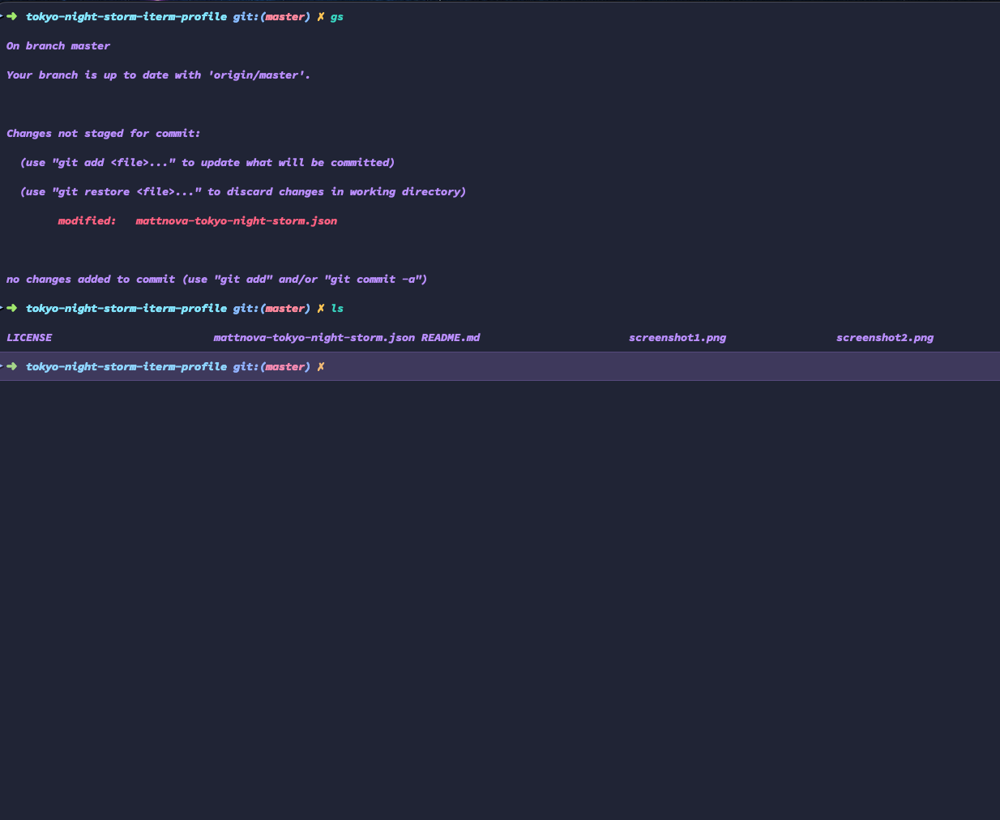
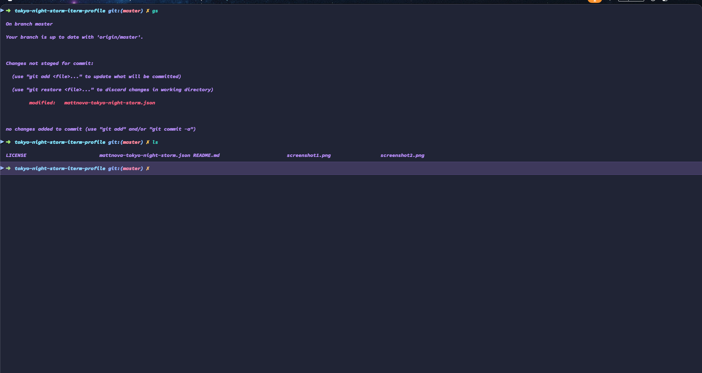

# MattNova Tokyo Night Storm iTerm2 Profile

My personalized take on **Tokyo Night Storm** — a moody, deep-dark theme with hand-tweaked colors for better contrast and legibility during long coding sessions. Includes transparency + blur for that immersive rainy-night feel, profile-specific hotkeys, Source Code Pro font setup (with Nerd Font upgrade path for icons), and more.

Inspired by the classic Tokyo Night ecosystem (VS Code / Neovim ports), but everything adjusted to fit my workflow in PHP/Laravel, JS/Vite, and general dev stuff.

## Preview





Moody cyberpunk/neon-city energy with subtle purples, cyans, and deep blues — perfect for late-night hacking while it pours outside 🌧️.

The terminal is slighly blurred and semi-transparent, so you can see your desktop wallpaper faintly behind it (I use a rainy Korean cityscape). The colors are tweaked for better contrast and readability, especially for syntax highlighting in code.

## Installation

1. Download the profile JSON:
   [mattnova-tokyo-night-storm.json](./mattnova-tokyo-night-storm.json)
   (or whatever you named it)

2. Open iTerm2 → **Preferences** (⌘+,) → **Profiles** tab.

3. Bottom-left (under the profiles list): **Other Actions...** → **Import JSON Profiles...**

4. Select the downloaded `.json` file.

5. The new profile appears in your list (named something like "MattNova Tokyo Night Storm" — you can rename it in the JSON if needed).

6. Select it → tweak font/path if desired → set as default or assign a hotkey.

This imports your full custom setup: colors, transparency level, blur, font settings, window prefs, profile-specific key mappings, etc.

**Tip:** Test in a new window/tab to confirm everything carries over (transparency, colors, hotkeys).

## Font Recommendation

For crisp text + full icon/glyph support (essential for Oh My Zsh prompts like powerlevel10k showing git branches, file icons, etc.):

- Upgrade from plain Source Code Pro to **SauceCodePro Nerd Font** (same look, +3600 icons added):

  ```bash
  brew install --cask font-sauce-code-pro-nerd-font

## Shell Setup (Oh My Zsh + Customizations)

To match the prompt/icons/git status in the preview screenshot, pair this iTerm2 profile with **Oh My Zsh** + **Powerlevel10k** (fast, customizable, Nerd Font-friendly).

1. Install Oh My Zsh:

   ```bash
   sh -c "$(curl -fsSL https://raw.githubusercontent.com/ohmyzsh/ohmyzsh/master/tools/install.sh)"
   ```

2. Add useful plugins (edit ~/.zshrc → plugins=(...)):Zsh

    ```bash
    plugins=(
        git
        zsh-autosuggestions
        zsh-syntax-highlighting
        you-should-use
        laravel
    )
    ```

3. Set theme

    ```bash
    ZSH_THEME="robbyrussell"
    ```

4. Useful Aliases (add to ~/.zshrc):

    ```bash
    # Misc
    alias zshconfig="code ~/.zshrc"
    alias ohmyzsh="code ~/.oh-my-zsh"
    alias zshreload="source ~/.zshrc"

    alias hostfile="sudo code /etc/hosts"
    alias publickey="pbcopy < ~/.ssh/id_rsa.pub"

    # OS Level
    alias c="clear"
    alias h="history"
    alias co="code ."
    alias o="open ."

    # Git
    alias gs="git status"
    alias gaa="git add ."
    alias gc="git commit -m"
    alias gp="git push"
    alias gl="git log"
    alias gco="git checkout"
    alias nah="git reset --hard && git clean -df"
    ```
